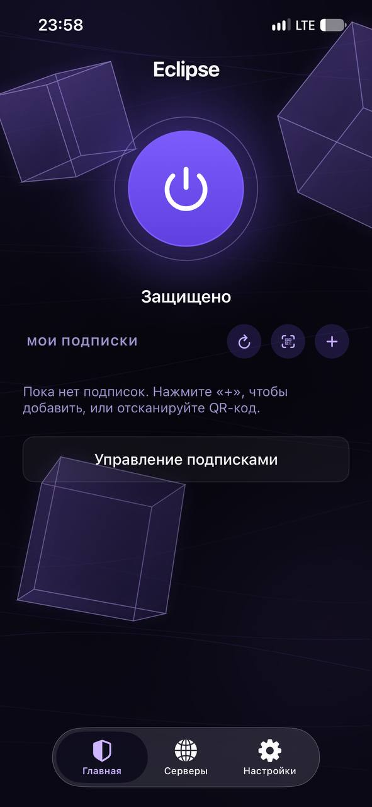
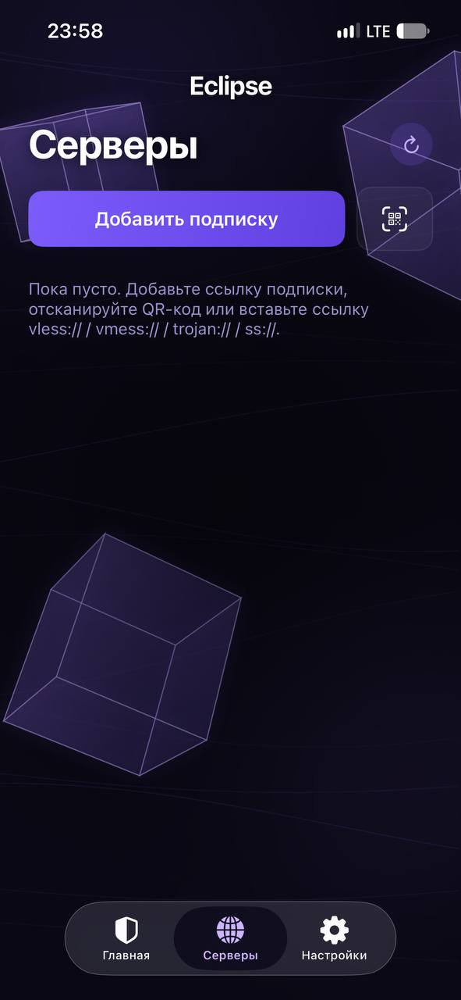
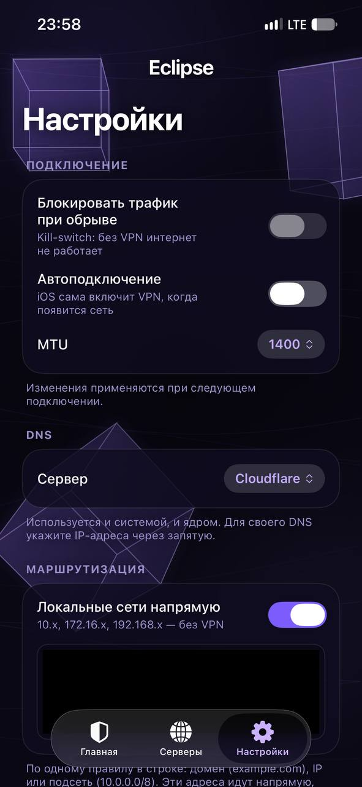

# Eclipse

**Лёгкий VPN-клиент для iOS на базе ядра Xray**

---

## О клиенте

**Eclipse** - открытый VPN-клиент для iOS, построенный на ядре **Xray-core**.
Клиент поддерживает современные протоколы и работает с любыми подписками
формата v2ray / Xray. Все подписки и серверы отображаются на главном
экране - без лишних переходов и меню.

Мы стремимся сделать подключение к VPN максимально простым: добавьте
подписку, выберите сервер и нажмите одну кнопку.

> **Важно.** Приложение не подписано и распространяется в виде
> `.ipa`-файла. Для установки Вам потребуется инструмент подписи -
> рекомендуем **ESign**.

---

## Возможности

### Поддерживаемые протоколы
- **VLESS**, включая XTLS-Vision и REALITY
- **VMess**
- **Trojan**
- **Shadowsocks**
- **Hysteria2** (через встроенный sing-box)
- **TUIC v5** (через встроенный sing-box)

### Транспорты
- TCP, WebSocket, gRPC, HTTP/2, HTTPUpgrade, xhttp
- TLS-маскировка, REALITY
- Настройка SNI, ALPN, fingerprint, spiderX

### Работа с подписками
- Добавление подписки по ссылке или через QR-код
- Импорт ссылки из буфера обмена
- Импорт QR-кода из изображения
- Автоматическое обновление подписок по расписанию
- Отображение израсходованного трафика, срока действия и прогресс-бар
- Сортировка серверов по пингу: TCP, HTTP GET, HTTP HEAD, ICMP
- Сохранение выбранного сервера между запусками
- Поддержка HWID-заголовков для провайдеров с привязкой к устройству

### Маршрутизация
- Ручные правила по доменам, IP-адресам и подсетям
- **GeoIP** и **GeoSite** - базы скачиваются автоматически
- Обход локальных сетей
- Определение трафика (sniffing) для маршрутизации по доменам
- Стратегия `AsIs` / `IPIfNonMatch`

### Сеть и безопасность
- **Kill-switch** - блокировка интернета при обрыве туннеля
- **Автоподключение (On-Demand)** - VPN включается сам при появлении сети
- Настройка DNS (Cloudflare, Google, Quad9, AdGuard или свой)
- Настройка MTU
- **Mux** - мультиплексирование соединений
- **Фрагментация TLS** - для обхода DPI-блокировок
- Отдельный IPv6-туннель без утечек

### Производительность
- Настраиваемый лимит памяти ядра Xray
- Оптимизированная сборка мусора для расширения iOS
- Экономичный расход батареи

### Интерфейс
- Тёмная и светлая темы (или как в системе) с анимированным фоном
- Автопереключение: если трафик перестал идти, клиент сам переходит на следующий сервер подписки
- DNS поверх HTTPS (DoH), свой DNS для каждой подписки
- Уведомления внутри клиента (подписка обновлена, серверы пропингованы и т. д.)
- Описание подписки (announce) под карточкой, как в Happ
- Встроенный журнал для диагностики: приложение, туннель и ядро; проверка, что трафик реально идёт
- Экспорт логов в одно нажатие
- Полностью на русском языке

---

## Установка через ESign

**ESign** - это инструмент для подписи и установки `.ipa`-файлов прямо
на iPhone, без использования компьютера. Вам потребуется собственный
сертификат подписи (`.p12`) и профиль (`.mobileprovision`).

### Что Вам понадобится

1. **iPhone или iPad** с iOS **15.0** или новее.
2. **Файл приложения** - `Eclipse-unsigned.ipa` со страницы
   [Releases](https://github.com/encore9999/eclipse-client/releases/latest).
3. **Сертификат подписи** - файл `.p12` и пароль к нему.
4. **Профиль подписи** - файл `.mobileprovision`.
5. **Установленный ESign** на iPhone.

> Сертификат и профиль можно приобрести у любого поставщика
> сертификатов Apple Developer (стоимость - от 5 до 20 USD в год).
> Также подойдёт Ваш собственный сертификат Apple Developer.

### Шаг 1. Установите ESign

1. Откройте сайт ESign в Safari на iPhone.
2. Скачайте и установите приложение ESign.
3. После установки доверьтесь профилю разработчика:
   **Настройки → Основные → VPN и управление устройством**.

### Шаг 2. Импортируйте сертификат

1. Откройте ESign.
2. Перейдите в раздел **«Подписи» (Signatures)**.
3. Нажмите **«+»** и выберите **«Импорт файла .p12»**.
4. Укажите путь к файлу `.p12` и введите пароль.
5. Затем импортируйте файл `.mobileprovision` тем же способом.
6. Убедитесь, что сертификат и профиль отображаются в списке
   и помечены как **действительные**.

### Шаг 3. Скачайте Eclipse

1. Откройте страницу [Releases](https://github.com/encore9999/eclipse-client/releases/latest) в Safari.
2. Скачайте файл `Eclipse-unsigned.ipa`.
3. Файл сохранится в папку **«Файлы» → «Загрузки»**.

### Шаг 4. Подпишите и установите

1. Откройте ESign.
2. Перейдите в раздел **«Подписать» (Sign)**.
3. Нажмите **«+»** и выберите скачанный файл `Eclipse-unsigned.ipa`.
4. В настройках подписи выберите **импортированный сертификат**
   и **профиль**.
5. Нажмите кнопку **«Подписать»**.
6. Дождитесь окончания процесса - обычно это занимает от 30 секунд
   до 2 минут.
7. После подписи нажмите **«Установить»**.

### Шаг 5. Доверьтесь приложению

1. После установки откройте:
   **Настройки → Основные → VPN и управление устройством**.
2. Найдите в списке разработчика, соответствующего Вашему сертификату.
3. Нажмите **«Доверять»**.
4. Вернитесь на рабочий стол - иконка **Eclipse** станет активной.

### Если что-то пошло не так

- **Не устанавливается**: убедитесь, что профиль `.mobileprovision`
  привязан к тому же сертификату `.p12`, что Вы импортировали.
- **Сертификат помечен как недействительный**: срок действия истёк -
  обновите сертификат у поставщика.
- **Приложение вылетает сразу после запуска**: отзовите сертификат
  у поставщика и подпишите `.ipa` заново.
- **«Не удалось проверить приложение»**: проверьте, что Вы доверились
  профилю разработчика в настройках iOS.

---

## Быстрый старт

1. **Добавьте подписку.**
   На главном экране нажмите **«+»** и вставьте ссылку `https://...`,
   либо нажмите иконку **QR-кода** и отсканируйте код подписки.

2. **Выберите сервер.**
   Серверы появятся под карточкой подписки. Нажмите на нужный -
   он станет активным.

3. **Подключитесь.**
   Нажмите кнопку питания в центре экрана. Через 1–3 секунды
   появится надпись **«Защищено»**.

4. **(Рекомендуется) Настройте маршрутизацию.**
   Откройте **Настройки → Маршрутизация (Geo)**, включите тумблер
   и укажите `ru` для GeoIP. Трафик к российским ресурсам пойдёт
   напрямую, минуя VPN.

---

## FAQ

<b>Почему файл .ipa не подписан?</b>

Apple требует Apple Developer аккаунт ($99/год) для распространения
подписанных приложений. Eclipse распространяется как открытый проект
без встроенной подписи, чтобы не накладывать на пользователей
обязательства по оплате. Подписать `.ipa` можно своим сертификатом
через ESign.

<b>Где взять сертификат для ESign?</b>

Сертификаты продают сторонние поставщики Apple Developer. Стоимость
обычно составляет от 5 до 20 USD в год. Также подойдёт Ваш личный
аккаунт Apple Developer.

<b>Через сколько сертификат перестанет работать?</b>

Срок действия зависит от сертификата. Обычно это 1 год для платных
сертификатов. Если подпись перестала работать - подпишите `.ipa`
заново тем же способом.

<b>Где взять подписку на VPN?</b>

Eclipse - это клиент, а не сервис. Подписки (`vless://`, `vmess://`,
`trojan://`, `ss://`) предоставляют сторонние провайдеры. Рекомендуем
выбирать проверенных поставщиков по отзывам.
Рекомендуем https://t.me/encorevpn_bot/

<b>GeoIP/GeoSite не работает. Что проверить?</b>

Откройте **Настройки → Диагностика**. Строка **«Geo-базы»** должна
показывать **«есть»**. Если **«нет»** - базы не скачались. Обычно
это происходит при первом запуске без интернета. Удалите подписку
и добавьте заново 0 базы скачаются автоматически.

<b>Kill-switch блокирует интернет после отключения VPN.</b>

Откройте **Настройки → Подключение → Блокировать трафик при обрыве**
и выключите тумблер. Изменение применится при следующем подключении.

<b>Почему Eclipse нет в App Store?</b>

Apple запрещает VPN-клиенты, не использующие исключительно
собственный протокол, а также клиенты для обхода блокировок.
Eclipse построен на ядре Xray-core, что не соответствует политике
App Store.

---

## Планы развития

- [x] Клиент для iOS 15+
- [x] Ядро Xray-core
- [x] REALITY и XTLS-Vision
- [x] Подписки и QR-коды
- [x] GeoIP / GeoSite маршрутизация
- [x] Kill-switch и On-Demand
- [x] Настраиваемый лимит памяти ядра
- [x] Поддержка sing-box
- [ ] Дополнительные pluggable-транспорты

---

## Технологии

- **Swift 5** и **SwiftUI**
- **Xray-core** - ядро прокси
- **Tun2SocksKit** - туннелирование TCP/UDP через SOCKS5
- **Go** и `gomobile` - сборка Xray в `.xcframework`
- **XcodeGen** - генерация Xcode-проекта
- **GitHub Actions** - CI для сборки ядра и приложения

---

## Структура проекта

eclipse-client/ 
├── App/ # Основное приложение 
│ ├── EclipseApp.swift # UI, Store, VPNController, настройки 
│ └── Assets.xcassets 
├── Tunnel/ # Расширение VPN-туннеля 
│ └── PacketTunnelProvider.swift 
├── Shared/ # Общий код (приложение + расширение) 
│ ├── Shared.swift # Модели, парсер ссылок, пингер 
│ ├── XrayConfigBuilder.swift 
│ └── GeoDat.swift # Парсер geoip.dat / geosite.dat 
├── xray/xraybridge/ # Go-мост для Xray-core 
├── Frameworks/ # Собранный Xray.xcframework 
├── .github/workflows/ # CI 
└── project.yml # Конфиг XcodeGen 

---

## Обратная связь

Если Вы обнаружили ошибку или хотите предложить улучшение, создайте
[новый Issue](https://github.com/encore9999/eclipse-client/issues/new).

Перед созданием Issue:
1. Проверьте, нет ли уже похожего обращения.
2. Если это ошибка - приложите журнал из **Настройки → Журнал**.
3. Укажите модель iPhone, версию iOS и версию Eclipse.

Мы также будем рады видеть Вас в нашем Telegram-канале:
[**@eclipse_client**](https://t.me/eclipseclientnews).

---

## Лицензия

Eclipse распространяется под лицензией **GPL-3.0**.

Ядро [Xray-core](https://github.com/XTLS/Xray-core) используется под
лицензией **MPL-2.0**. Библиотека
[Tun2SocksKit](https://github.com/EbrahimTahernejad/Tun2SocksKit) -
под лицензией **MIT**.

---

**Если Eclipse оказался Вам полезен - поставьте ⭐ репозиторию.
Это лучший способ поддержать проект.**

